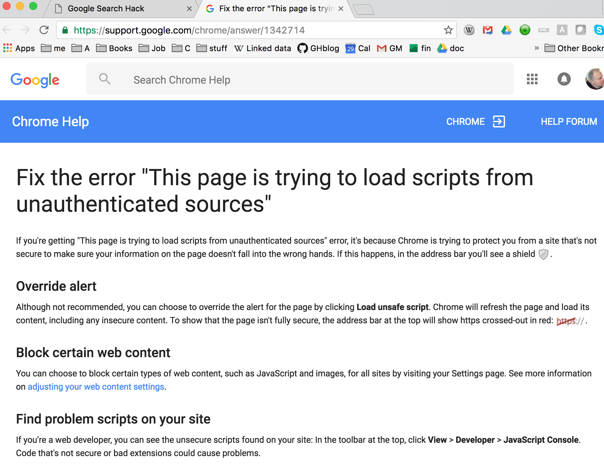

<!--
-->

https://httpoxy.org/
https://news.ycombinator.com/item?id=12115051
https://www.apache.org/security/asf-httpoxy-response.txt
https://github.com/httpoxy
https://tools.ietf.org/html/rfc3875
https://isc.sans.edu/diary/HTTP+Proxy+Header+Vulnerability+%28%22httpoxy%22%29/21271

http://www.haproxy.org/download/1.5/doc/proxy-protocol.txt
https://en.wikipedia.org/wiki/Petname

Google Frame Options
--------------------

Google does not allow iframe inclusion of the search page.
They add the `X-Frame-Options:SAMEORIGIN` header.


Github Protects
---------------

Posting a page on github that demonstrates vulnerabilities, Chrome
produces an error about loading scripts from unsafe sources.


> Notice the warning icon



> The help description from Chrome

The curl request shows that github is adding a CORS header that
should allow any script.

> Does CORS only allow XHR XSS?

```
GET /vulnerabilities/iframe.html HTTP/1.1
> Host: karlredgate.github.io
> User-Agent: curl/7.49.1
> Accept: */*
>
< HTTP/1.1 200 OK
< Server: GitHub.com
< Content-Type: text/html; charset=utf-8
< Last-Modified: Mon, 08 Aug 2016 15:50:50 GMT
< Access-Control-Allow-Origin: *
< Expires: Mon, 08 Aug 2016 16:03:23 GMT
< Cache-Control: max-age=600
< X-GitHub-Request-Id: 689C5C1F:10DF:A52C2FC:57A8AAF3
< Content-Length: 931
< Accept-Ranges: bytes
< Date: Mon, 08 Aug 2016 15:53:23 GMT
< Via: 1.1 varnish
< Age: 0
< Connection: keep-alive
< X-Served-By: cache-bos8223-BOS
< X-Cache: MISS
< X-Cache-Hits: 0
< Vary: Accept-Encoding
< X-Fastly-Request-ID: 733f30894078adf68b1e56f6c7c200b2abd86258
```

<!-- vim: set autoindent expandtab sw=4 syntax=markdown: -->
